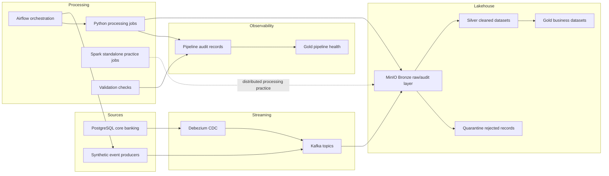

# Banking-Grade Real-Time Risk, Fraud & Compliance Data Platform

This project simulates an enterprise banking data platform using synthetic data.

## Architecture

The platform follows a hybrid streaming, CDC, and batch lakehouse architecture.
It is designed to look like a small banking data platform running locally with
Docker Compose.



Core components:

- PostgreSQL simulates core banking system-of-record data.
- Debezium captures database changes from PostgreSQL into Kafka CDC topics.
- Kafka carries card authorization, login, fraud risk, and CDC events.
- Python producers simulate real-time banking source systems.
- MinIO provides S3-style object storage for Bronze, Silver, Gold, quarantine, and audit data.
- Airflow orchestrates the Phase 2 fresh-partition pipeline.
- Spark standalone services support distributed processing practice.
- Validation scripts enforce Bronze, Silver, and Gold quality checks.
- Pipeline audit records feed Gold observability and latest-health outputs.

Medallion data model:

- Bronze keeps raw Kafka messages plus source metadata such as topic, partition, offset, key, and ingest time.
- Silver applies validation, type normalization, deduplication, and rejected-record quarantine.
- Gold builds business-ready datasets for transaction monitoring, fraud investigation, and pipeline health.

Operational principles:

- Every run uses explicit `ProcessDate`, `IngestDate`, and `RiskIngestDate` values.
- Jobs are partition-aware so a date can be replayed without relying on the laptop clock.
- Rejected records are written to quarantine with source object details and rejection reasons.
- Audit records capture job status, records read, records written, rejected counts, timing, and output paths.

## Current State

The local platform currently supports:

- PostgreSQL core banking tables with Debezium CDC into Kafka
- Synthetic Kafka producers for card authorization, login, and fraud risk events
- Bronze landing from Kafka into MinIO
- Silver cleansing and deduplication for card authorization and login events
- Gold transaction monitoring dashboard dataset
- Gold fraud investigation case dataset
- Bronze, Silver, and Gold validation scripts
- Quarantine handling for rejected Silver records
- Pipeline audit and Gold pipeline health observability
- Spark standalone services for distributed processing practice

The project now follows a medallion-style local lakehouse flow:

```text
Kafka / CDC sources
  -> MinIO Bronze
  -> Silver cleaned datasets
  -> Gold business-ready datasets
```

Current engineering focus:

- Partition-aware processing with explicit `ProcessDate`
- Rerun safety and idempotency
- Data quality checks per partition
- Auditability through Kafka topic, partition, offset, and ingest metadata
- Rejected-record traceability through quarantine records

## What This Project Demonstrates

This repository is designed as a practical banking data engineering portfolio
project. It demonstrates:

- event-driven ingestion with Kafka producers and CDC-style infrastructure
- Bronze, Silver, and Gold medallion processing over S3-compatible storage
- partition-aware replay using explicit business dates
- data quality validation and rejected-record quarantine
- Airflow orchestration with scheduled and manual DAG runs
- pipeline audit records and latest-health Gold observability outputs
- monitoring rules that convert Gold outputs into operational findings
- local alert delivery with append-only alert history
- a static operations dashboard for pipeline, transaction, fraud, monitoring, and alert review

## End-to-End Demo

Start the local platform:

```powershell
docker compose up -d
```

Open Airflow:

```text
http://localhost:8088
```

Trigger the fresh partition DAG from Airflow, or use the command line:

```powershell
docker compose exec airflow-scheduler airflow dags trigger banking_fresh_partition_pipeline --exec-date 2026-05-28T00:00:00+00:00 --run-id manual__2026_05_28_demo
```

The DAG runs the full operational flow:

```text
Kafka producers
  -> Bronze landing
  -> Silver cleansing and validation
  -> Gold transaction monitoring and fraud investigation
  -> Gold pipeline health
  -> monitoring rules
  -> local alert delivery
  -> operational dashboard render
```

For a focused replay demo against existing Gold outputs:

```powershell
powershell -ExecutionPolicy Bypass -File scripts/setup/evaluate_monitoring_rules.ps1 -ProcessDate 2026-05-28
powershell -ExecutionPolicy Bypass -File scripts/setup/deliver_monitoring_alerts.ps1 -ProcessDate 2026-05-28
powershell -ExecutionPolicy Bypass -File scripts/setup/render_operational_dashboard.ps1 -ProcessDate 2026-05-28
```

Open the generated dashboard:

```text
data/dashboards/operational_dashboard_2026-05-28.html
```

## Dashboard Demo

The project includes a generated local operations dashboard built from Gold
outputs in MinIO. It is rendered as static HTML so it can be refreshed from
Airflow without running a separate web application.

Render the dashboard for a process date:

```powershell
powershell -ExecutionPolicy Bypass -File scripts/setup/evaluate_monitoring_rules.ps1 -ProcessDate 2026-05-28
powershell -ExecutionPolicy Bypass -File scripts/setup/deliver_monitoring_alerts.ps1 -ProcessDate 2026-05-28
powershell -ExecutionPolicy Bypass -File scripts/setup/render_operational_dashboard.ps1 -ProcessDate 2026-05-28
```

Open the generated file:

```text
data/dashboards/operational_dashboard_2026-05-28.html
```

The dashboard demonstrates:

- pipeline health KPIs from the latest Gold health dataset
- monitoring rule status and warning/critical findings
- local alert delivery summary and append-only alert history
- records moved, rejected records, and job status by partition
- transaction monitoring KPIs, approval mix, amount by channel, and top aggregates
- fraud investigation KPIs, fraud risk levels, and top investigation cases
- duplicate fraud case detection from repeated runs
- unmatched fraud-to-transaction joins shown as operational signals

For a demo walkthrough, show:

- Airflow DAG grid with the `render_operational_dashboard` final task
- the dashboard KPI strip, Monitoring Findings, Alert Delivery, and Operations Summary section
- Approval Mix, Amount by Channel, and Fraud Risk Levels charts
- Pipeline Health, Transaction Monitoring, and Fraud Investigation tables

## Operational Monitoring & Alerting

Monitoring is built on top of Gold outputs so alerts are based on curated,
business-ready data rather than raw task logs.

The monitoring evaluator reads:

- latest Gold pipeline health
- Gold transaction monitoring aggregates
- Gold fraud investigation cases

It writes a monitoring report:

```text
data/monitoring/monitoring_report_YYYY-MM-DD.json
```

Current monitoring rules detect:

- missing Gold outputs
- non-success latest pipeline jobs
- rejected records in latest pipeline health
- high transaction decline rate
- high fraud risk score
- duplicate fraud case rows across repeated runs
- fraud cases without matched merchant context

Alert delivery converts monitoring findings into local alert records. This keeps
the demo self-contained while still showing the production pattern: findings
become delivered alerts and an auditable alert history.

Alert outputs:

```text
data/monitoring/alert_history.jsonl
data/monitoring/alert_summary_YYYY-MM-DD.json
```

In Airflow, the operational tail of the DAG is:

```text
run_gold_pipeline_health
  -> show_latest_pipeline_health
  -> evaluate_monitoring_rules
  -> deliver_monitoring_alerts
  -> render_operational_dashboard
```

## Recommended Run Pattern

Use an explicit business date instead of relying on the server clock:

```powershell
powershell -ExecutionPolicy Bypass -File scripts/setup/run_silver_card_authorizations.ps1 -ProcessDate 2026-05-21
powershell -ExecutionPolicy Bypass -File scripts/setup/validate_silver_card_authorizations.ps1 -ProcessDate 2026-05-21
```

```powershell
powershell -ExecutionPolicy Bypass -File scripts/setup/run_gold_transaction_monitoring.ps1 -ProcessDate 2026-05-21
powershell -ExecutionPolicy Bypass -File scripts/setup/validate_gold_transaction_monitoring.ps1 -ProcessDate 2026-05-21
```

## Fresh Partition Demo Path

This path proves the pipeline can replay a new partition from producers through Gold
outputs and observability. Replace `2026-05-25` with the business date being tested.

## Phase 2 Airflow Orchestration

Phase 2 introduces Apache Airflow as the orchestration layer for the fresh partition
pipeline. The DAG is defined in `dags/banking_fresh_partition_pipeline.py`.

The DAG is scheduled to run daily at `02:00 UTC`:

```text
0 2 * * *
```

`catchup` is disabled, and `max_active_runs` is set to `1` so Airflow does not
run overlapping fresh-partition jobs. Scheduled runs generate new synthetic Kafka
events because the producer tasks are part of this DAG.

Start Airflow with the rest of the local platform:

```powershell
docker compose up -d
```

Airflow uses a local custom image defined in `docker/airflow/Dockerfile`.
Project Python dependencies are installed when the image is built, not every
time the webserver or scheduler starts. Rebuild the image after changing
`requirements.txt`:

```powershell
docker compose build airflow-init airflow-webserver airflow-scheduler
docker compose up -d
```

Open the Airflow UI:

```text
http://localhost:8088
```

Default local credentials:

```text
admin / admin
```

To confirm whether a run was manual or scheduled, open the DAG run in Airflow and
check **Run type**:

- `manual` means it was started from the UI or with `airflow dags trigger`.
- `scheduled` means the Airflow scheduler started it from the daily cron schedule.

Trigger the DAG with a JSON config:

```json
{
  "process_date": "2026-05-25",
  "ingest_date": "2026-05-25",
  "risk_ingest_date": "2026-05-25",
  "skip_producers": false
}
```

For replaying already-landed Bronze data without producing new Kafka events, set:

```json
{
  "process_date": "2026-05-25",
  "ingest_date": "2026-05-25",
  "risk_ingest_date": "2026-05-25",
  "skip_producers": true
}
```

The same DAG can also be triggered from the command line:

```powershell
docker compose exec airflow-scheduler airflow dags trigger banking_fresh_partition_pipeline --conf '{"process_date":"2026-05-25","ingest_date":"2026-05-25","risk_ingest_date":"2026-05-25","skip_producers":false}'
```

If PowerShell quoting causes JSON parsing errors, trigger a scheduled-style run
without JSON config by setting the logical date:

```powershell
docker compose exec airflow-scheduler airflow dags trigger banking_fresh_partition_pipeline --exec-date 2026-05-25T00:00:00+00:00 --run-id manual__2026_05_25_fresh
```

Operational checks:

```powershell
docker compose ps
docker compose logs --tail 120 airflow-webserver
docker compose logs --tail 120 airflow-scheduler
docker compose logs --tail 120 kafka
```

If the Airflow UI at `http://localhost:8088` refuses the connection, recreate only
the webserver container:

```powershell
docker compose up -d --force-recreate airflow-webserver
```

If Docker Desktop starts returning HTTP 500 errors for Docker commands, restart
Docker Desktop or run:

```powershell
wsl --shutdown
```

Then reopen Docker Desktop and run:

```powershell
docker compose up -d
```

The manual command sequence below is kept as an expanded reference and fallback.

```powershell
powershell -ExecutionPolicy Bypass -File scripts/setup/check_platform_health.ps1
```

Generate and land Bronze events:

```powershell
powershell -ExecutionPolicy Bypass -File scripts/setup/run_bulk_card_authorization_producer.ps1
powershell -ExecutionPolicy Bypass -File scripts/setup/run_bulk_bronze_card_authorization_writer.ps1 -IngestDate 2026-05-25

powershell -ExecutionPolicy Bypass -File scripts/setup/run_login_event_producer.ps1
powershell -ExecutionPolicy Bypass -File scripts/setup/run_bronze_login_events_writer.ps1 -IngestDate 2026-05-25

powershell -ExecutionPolicy Bypass -File scripts/setup/run_risk_event_producer.ps1
powershell -ExecutionPolicy Bypass -File scripts/setup/run_bronze_risk_events_writer.ps1 -IngestDate 2026-05-25
```

Run and validate Silver and Gold:

```powershell
powershell -ExecutionPolicy Bypass -File scripts/setup/run_silver_card_authorizations.ps1 -ProcessDate 2026-05-25
powershell -ExecutionPolicy Bypass -File scripts/setup/validate_silver_card_authorizations.ps1 -ProcessDate 2026-05-25

powershell -ExecutionPolicy Bypass -File scripts/setup/run_silver_login_events.ps1 -ProcessDate 2026-05-25 -BronzeIngestDate 2026-05-25
powershell -ExecutionPolicy Bypass -File scripts/setup/validate_silver_login_events.ps1 -ProcessDate 2026-05-25

powershell -ExecutionPolicy Bypass -File scripts/setup/run_gold_transaction_monitoring.ps1 -ProcessDate 2026-05-25
powershell -ExecutionPolicy Bypass -File scripts/setup/validate_gold_transaction_monitoring.ps1 -ProcessDate 2026-05-25

powershell -ExecutionPolicy Bypass -File scripts/setup/run_gold_fraud_investigation.ps1 -ProcessDate 2026-05-25 -RiskIngestDate 2026-05-25
powershell -ExecutionPolicy Bypass -File scripts/setup/validate_gold_fraud_investigation.ps1 -ProcessDate 2026-05-25
```

Refresh and inspect pipeline health:

```powershell
powershell -ExecutionPolicy Bypass -File scripts/setup/run_gold_pipeline_health.ps1 -ProcessDate 2026-05-25
powershell -ExecutionPolicy Bypass -File scripts/setup/show_latest_pipeline_health.ps1 -ProcessDate 2026-05-25
```

Evaluate monitoring rules:

```powershell
powershell -ExecutionPolicy Bypass -File scripts/setup/evaluate_monitoring_rules.ps1 -ProcessDate 2026-05-25
```

Deliver local alert notifications and append alert history:

```powershell
powershell -ExecutionPolicy Bypass -File scripts/setup/deliver_monitoring_alerts.ps1 -ProcessDate 2026-05-25
```

Render a local operational dashboard from Gold outputs:

```powershell
powershell -ExecutionPolicy Bypass -File scripts/setup/render_operational_dashboard.ps1 -ProcessDate 2026-05-25
```

The dashboard is written under:

```text
data/dashboards/operational_dashboard_YYYY-MM-DD.html
```

The monitoring report is written under:

```text
data/monitoring/monitoring_report_YYYY-MM-DD.json
```

Alert delivery writes an append-only history and latest summary under:

```text
data/monitoring/alert_history.jsonl
data/monitoring/alert_summary_YYYY-MM-DD.json
```

Expected healthy signals:

- Silver card authorizations writes 1,500 records with 0 rejected records.
- Silver login events writes valid login records with 0 rejected records.
- Gold transaction monitoring writes 10 aggregate rows.
- Gold fraud investigation writes 3 case rows.
- Latest pipeline health shows success for Silver and Gold jobs.
