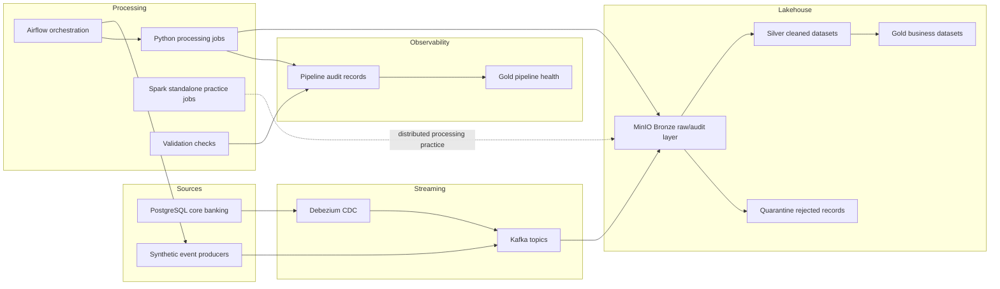

# Banking-Grade Real-Time Risk, Fraud & Compliance Data Platform

This project simulates an enterprise banking data platform using synthetic data.

## Architecture

The platform follows a hybrid streaming, CDC, and batch lakehouse architecture.
It is designed to look like a small banking data platform running locally with
Docker Compose.



Core components:

- PostgreSQL simulates core banking system-of-record data.
- Debezium captures database changes from PostgreSQL into Kafka CDC topics.
- Kafka carries card authorization, login, fraud risk, and CDC events.
- Python producers simulate real-time banking source systems.
- MinIO provides S3-style object storage for Bronze, Silver, Gold, quarantine, and audit data.
- Airflow orchestrates the Phase 2 fresh-partition pipeline.
- Spark standalone services support distributed processing practice.
- Validation scripts enforce Bronze, Silver, and Gold quality checks.
- Pipeline audit records feed Gold observability and latest-health outputs.

Medallion data model:

- Bronze keeps raw Kafka messages plus source metadata such as topic, partition, offset, key, and ingest time.
- Silver applies validation, type normalization, deduplication, and rejected-record quarantine.
- Gold builds business-ready datasets for transaction monitoring, fraud investigation, and pipeline health.

Operational principles:

- Every run uses explicit `ProcessDate`, `IngestDate`, and `RiskIngestDate` values.
- Jobs are partition-aware so a date can be replayed without relying on the laptop clock.
- Rejected records are written to quarantine with source object details and rejection reasons.
- Audit records capture job status, records read, records written, rejected counts, timing, and output paths.

## Current State

The local platform currently supports:

- PostgreSQL core banking tables with Debezium CDC into Kafka
- Synthetic Kafka producers for card authorization, login, and fraud risk events
- Bronze landing from Kafka into MinIO
- Silver cleansing and deduplication for card authorization and login events
- Gold transaction monitoring dashboard dataset
- Gold fraud investigation case dataset
- Bronze, Silver, and Gold validation scripts
- Quarantine handling for rejected Silver records
- Pipeline audit and Gold pipeline health observability
- Spark standalone services for distributed processing practice

The project now follows a medallion-style local lakehouse flow:

```text
Kafka / CDC sources
  -> MinIO Bronze
  -> Silver cleaned datasets
  -> Gold business-ready datasets
```

Current engineering focus:

- Partition-aware processing with explicit `ProcessDate`
- Rerun safety and idempotency
- Data quality checks per partition
- Auditability through Kafka topic, partition, offset, and ingest metadata
- Rejected-record traceability through quarantine records

## Recommended Run Pattern

Use an explicit business date instead of relying on the server clock:

```powershell
powershell -ExecutionPolicy Bypass -File scripts/setup/run_silver_card_authorizations.ps1 -ProcessDate 2026-05-21
powershell -ExecutionPolicy Bypass -File scripts/setup/validate_silver_card_authorizations.ps1 -ProcessDate 2026-05-21
```

```powershell
powershell -ExecutionPolicy Bypass -File scripts/setup/run_gold_transaction_monitoring.ps1 -ProcessDate 2026-05-21
powershell -ExecutionPolicy Bypass -File scripts/setup/validate_gold_transaction_monitoring.ps1 -ProcessDate 2026-05-21
```

## Fresh Partition Demo Path

This path proves the pipeline can replay a new partition from producers through Gold
outputs and observability. Replace `2026-05-25` with the business date being tested.

## Phase 2 Airflow Orchestration

Phase 2 introduces Apache Airflow as the orchestration layer for the fresh partition
pipeline. The DAG is defined in `dags/banking_fresh_partition_pipeline.py`.

Start Airflow with the rest of the local platform:

```powershell
docker compose up -d
```

Open the Airflow UI:

```text
http://localhost:8088
```

Default local credentials:

```text
admin / admin
```

Trigger the DAG with a JSON config:

```json
{
  "process_date": "2026-05-25",
  "ingest_date": "2026-05-25",
  "risk_ingest_date": "2026-05-25",
  "skip_producers": false
}
```

For replaying already-landed Bronze data without producing new Kafka events, set:

```json
{
  "process_date": "2026-05-25",
  "ingest_date": "2026-05-25",
  "risk_ingest_date": "2026-05-25",
  "skip_producers": true
}
```

The same DAG can also be triggered from the command line:

```powershell
docker compose exec airflow-scheduler airflow dags trigger banking_fresh_partition_pipeline --conf '{"process_date":"2026-05-25","ingest_date":"2026-05-25","risk_ingest_date":"2026-05-25","skip_producers":false}'
```

The manual command sequence below is kept as an expanded reference and fallback.

```powershell
powershell -ExecutionPolicy Bypass -File scripts/setup/check_platform_health.ps1
```

Generate and land Bronze events:

```powershell
powershell -ExecutionPolicy Bypass -File scripts/setup/run_bulk_card_authorization_producer.ps1
powershell -ExecutionPolicy Bypass -File scripts/setup/run_bulk_bronze_card_authorization_writer.ps1 -IngestDate 2026-05-25

powershell -ExecutionPolicy Bypass -File scripts/setup/run_login_event_producer.ps1
powershell -ExecutionPolicy Bypass -File scripts/setup/run_bronze_login_events_writer.ps1 -IngestDate 2026-05-25

powershell -ExecutionPolicy Bypass -File scripts/setup/run_risk_event_producer.ps1
powershell -ExecutionPolicy Bypass -File scripts/setup/run_bronze_risk_events_writer.ps1 -IngestDate 2026-05-25
```

Run and validate Silver and Gold:

```powershell
powershell -ExecutionPolicy Bypass -File scripts/setup/run_silver_card_authorizations.ps1 -ProcessDate 2026-05-25
powershell -ExecutionPolicy Bypass -File scripts/setup/validate_silver_card_authorizations.ps1 -ProcessDate 2026-05-25

powershell -ExecutionPolicy Bypass -File scripts/setup/run_silver_login_events.ps1 -ProcessDate 2026-05-25 -BronzeIngestDate 2026-05-25
powershell -ExecutionPolicy Bypass -File scripts/setup/validate_silver_login_events.ps1 -ProcessDate 2026-05-25

powershell -ExecutionPolicy Bypass -File scripts/setup/run_gold_transaction_monitoring.ps1 -ProcessDate 2026-05-25
powershell -ExecutionPolicy Bypass -File scripts/setup/validate_gold_transaction_monitoring.ps1 -ProcessDate 2026-05-25

powershell -ExecutionPolicy Bypass -File scripts/setup/run_gold_fraud_investigation.ps1 -ProcessDate 2026-05-25 -RiskIngestDate 2026-05-25
powershell -ExecutionPolicy Bypass -File scripts/setup/validate_gold_fraud_investigation.ps1 -ProcessDate 2026-05-25
```

Refresh and inspect pipeline health:

```powershell
powershell -ExecutionPolicy Bypass -File scripts/setup/run_gold_pipeline_health.ps1 -ProcessDate 2026-05-25
powershell -ExecutionPolicy Bypass -File scripts/setup/show_latest_pipeline_health.ps1 -ProcessDate 2026-05-25
```

Expected healthy signals:

- Silver card authorizations writes 1,500 records with 0 rejected records.
- Silver login events writes valid login records with 0 rejected records.
- Gold transaction monitoring writes 10 aggregate rows.
- Gold fraud investigation writes 3 case rows.
- Latest pipeline health shows success for Silver and Gold jobs.
